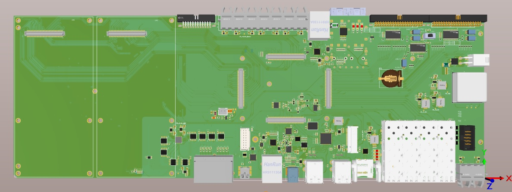
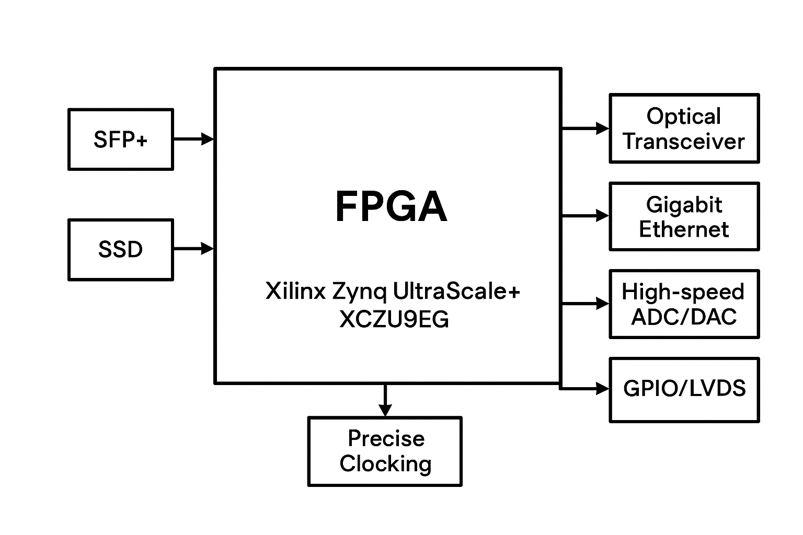
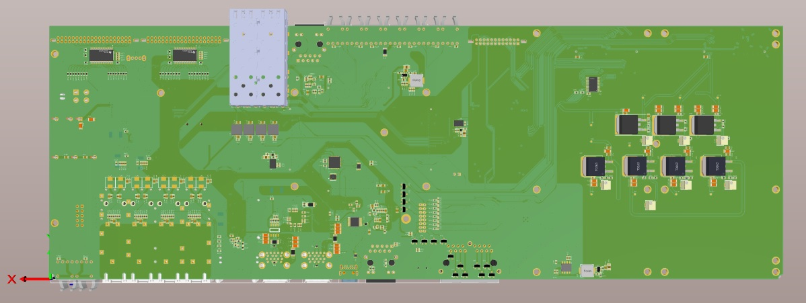

# AXU9EG FPGA Development Board

A custom high-performance FPGA board based on the **Xilinx Zynq UltraScale+ MPSoC XCZU9EG**, designed for high-speed data processing, precision analog interfacing, and advanced embedded applications.

---

## 🚀 Key Features
- **6× SFP+ ports** – Multi-gigabit optical and copper transceiver support.
- **Integrated optical transceiver** – Direct fiber-optic communication.
- **M.2 NVMe SSD interface** – High-speed on-board storage.
- **High-speed ADC/DAC connectivity** – External high-resolution converters.
- **Isolated power supply for ADC/DAC** – Ultra-low-noise precision operation.
- **Gigabit Ethernet interface** – Stable wired communication.
- **Multiple GPIO/LVDS channels** – Flexible expansion.
- **Precision clocking** – Low-jitter sampling and data transmission.

---

## 📊 Technical Specifications

| Feature | Description |
|---------|-------------|
| FPGA | Xilinx Zynq UltraScale+ MPSoC XCZU9EG |
| SFP+ Ports | 6×, multi-gigabit |
| SSD Interface | M.2 NVMe |
| Ethernet | 1× Gigabit Ethernet |
| ADC/DAC Interface | High-speed, isolated power |
| GPIO | Multiple high-speed GPIO/LVDS |
| Clocking | Low-jitter precision clocks |
| Power | Multi-rail, robust regulation |

---

## 📦 Applications
- Software-Defined Radio (SDR)
- High-speed data acquisition & waveform generation
- Optical networking & real-time packet processing
- Radar, sonar, and sensor fusion systems
- FPGA-based AI & DSP acceleration

---

## 📐 Block Diagram

---

## 📸 Gallery
| Top View | Bottom View |
|----------|-------------|
|  |  |

---

## 📄 License
This project is licensed under the MIT License – see the [LICENSE](LICENSE) file for details.

---
